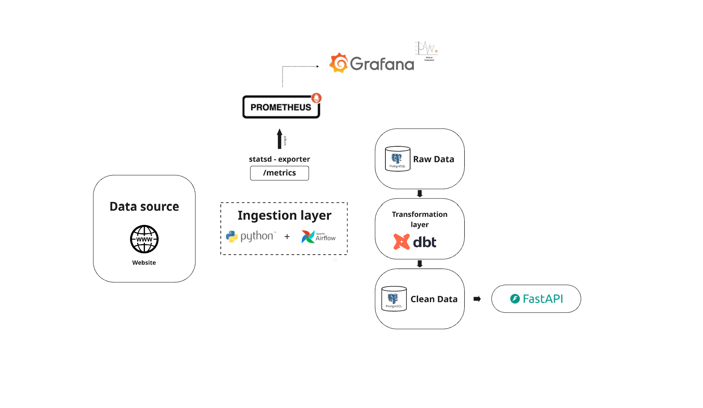

# Web Data Pipeline — Web Scraping, Airflow, PostgreSQL, dbt, FastAPI




## Overview

This project is an **end-to-end data pipeline** that:
1. Scrapes book data from [Books to Scrape](https://books.toscrape.com/).
2. Loads raw data into **PostgreSQL** via **Apache Airflow**.
3. Cleans and transforms data with **dbt**.
4. Exposes processed data through a **FastAPI REST API**.

The goal is to demonstrate **ETL orchestration**, **SQL transformations**, and **API integration** in a real-world workflow.

---

## Tech Stack

| Tool         | Purpose |
|--------------|---------|
| **Python**   | Web scraping, ETL tasks |
| **BeautifulSoup4** | HTML parsing |
| **PostgreSQL** | Raw & cleaned data storage |
| **Apache Airflow** | DAG orchestration |
| **dbt-core** | Data transformations |
| **FastAPI**  | REST API for serving data |
| **Docker**   | Containerized environment |

---

## Project Goal

The goal of this project is to design and implement a **complete, production-style data pipeline** that demonstrates how to:

1. **Extract** structured data from an external source (in this case, a public e-commerce/book website — used here only as an example; the same approach can be applied to any HTML/JSON API source such as product catalogs, news portals, or job boards).
2. **Ingest** and **orchestrate** the extraction process using **Apache Airflow**, ensuring automation, scheduling, and monitoring of data workflows.
3. **Store raw data** in a **PostgreSQL** database for persistence and reproducibility.
4. **Transform** raw data into a clean, analytics-ready format using **dbt**, following best practices for modular SQL modeling.
5. **Serve** the cleaned data through a **FastAPI** REST interface, enabling integration with other systems or easy data exploration.
6. **Monitor and visualize** pipeline performance using an **observability stack**:
   - **StatsD Exporter**: Collects Airflow’s operational metrics.
   - **Prometheus**: Pulls metrics in Prometheus exposition format for time-series storage.
   - **Grafana**: Visualizes DAG run durations, task success/failure rates, and scheduler health through interactive dashboards.


## Manual Build

**1. Clone env.example file**
```
cp .env.example .env
```

**2. Start the stack**
```
docker compose up -d --build
```

**3. Check containers:**
```
docker compose ps
```
You should see: postgres, airflow-webserver, airflow-scheduler, airflow-triggerer, prometheus, grafana, statsd-exporter

**4. Open Airflow UI**

URL: http://localhost:8080
User/Pass: airflow / airflow (configured in compose)

- Create the Postgres Connection (one time)

Airflow → Admin → Connections → +
Fill in:

- Conn Id: my_postgres_conn
- Conn Type: Postgres
- Host: postgres (service name, not localhost)
- Schema: books
- Login: postgres
- Password: postgres
- Port: 5432
Save.


**5. Run the pipeline**

In Airflow → DAGs, run your DAG (e.g., scrape_and_store_books).

**6. Verify data in Postgres**

From the Postgres container:
```
# list tables
docker compose exec postgres psql -U postgres -d books -c "SELECT table_schema, table_name FROM information_schema.tables WHERE table_schema='public' ORDER BY 1,2;"

# preview raw rows
docker compose exec postgres psql -U postgres -d books -c "SELECT * FROM public.books LIMIT 5;"

# preview cleaned rows
docker compose exec postgres psql -U postgres -d books -c "SELECT * FROM public.clean_books LIMIT 5;"
```

## Fastapi configuration

**7. Activate virtual environment**

```
python -m venv new_venv
source new_venv/bin/activate    # Linux/Mac
new_venv\Scripts\activate       # Windows
```

**8. Install requirements**

```
pip install -r requiriments.txt
```

**9. Run FastAPI server**

```
uvicorn fastapi_app.main:app --reload --port 8000
```

**10. Open API docs**

- Swagger UI: http://127.0.0.1:8000/docs
- ReDoc: http://127.0.0.1:8000/redoc